# On2N
# Python Object Writing Service

This repository contains a Python Flask-based service that writes objects to a file and is hosted on an AWS EC2 instance. The infrastructure for the EC2 instance is provisioned using Terraform.

## Table of Contents
- [Features](#features)
- [Prerequisites](#prerequisites)
- [Installation](#installation)
- [Integrate Terraform with Jenkins](#terraform-configuration)
- [AWS EC2 Setup](#aws-ec2-setup)
- [API Endpoints](#api-endpoints)
- [S3 Bucket](#s3-bucket)
- [Running the Service](#running-the-service)
- [Contributing](#contributing)

## Features

- Python Flask-based API service.
- Writes objects and it's file.
- Deployed on AWS EC2 and install python3,nginx and openssl for https for public ip .
- EC2 infrastructure is provisioned using Terraform.
- Exposes API endpoints for interaction on port `3000`.

## Prerequisites

Before you begin, make sure you have the following installed on your machine, so i have done it through user data script while launch EC2:

- **Python 3**
- **pip** (Python package manager)
- **Flask** and **Boto3** (You will install these in the steps below)
- **Terraform** (the terraform is install in another server in which jenkins is install)

## Installation

1. **Clone the repository**:
   ```bash
   git clone https://github.com/yourusername/your-repo-name.git
   cd your-repo-name

   pip install flask boto3

   sudo apt install nginx -y

## Integrate Terraform with Jenkins
- **Plugin** Install terraform plugin in jenkins, as i have already install so it is not showing here
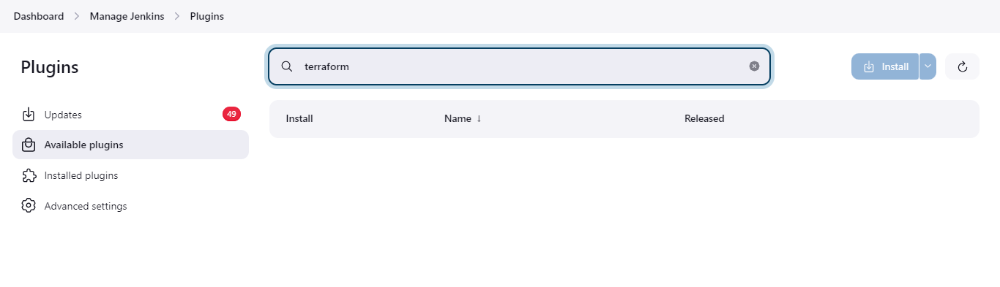

- **configure** Add the path of terraform in terraform configuration
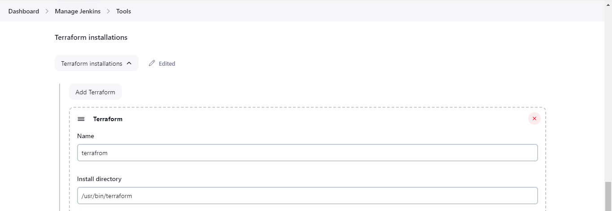

## AWS EC2 Setup
- This service is hosted on an EC2 instance, which is created using Terraform.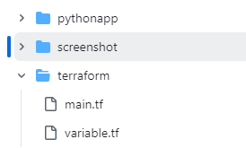
- This is the file structure of terraform.
1. **Deployment steps**: This things are done using jenkins.
- **terraform init** : Initialize Terraform
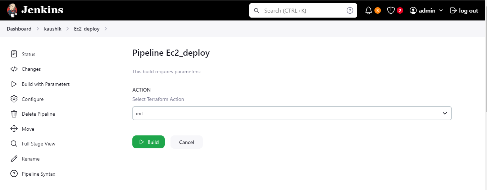

- **terraform plan** : Generates an execution plan showing the changes to infrastructure resources that Terraform will make based on your configuration files.
- **terraform apply** : Applies the changes described in the Terraform execution plan to provision or modify infrastructure as defined in your configuration.
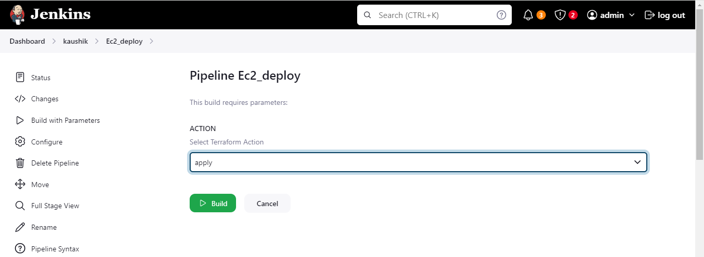

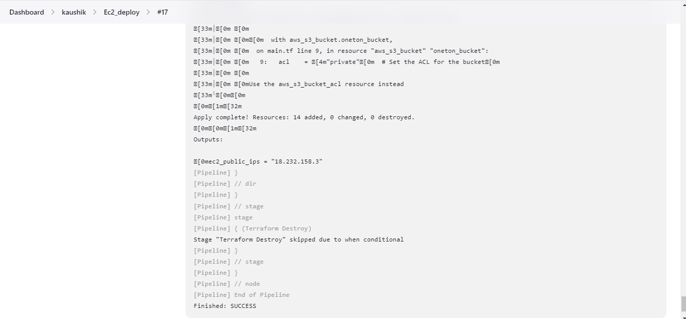
- **terraform destroy** : Destroys all resources defined in your Terraform configuration, effectively tearing down the infrastructure provisioned

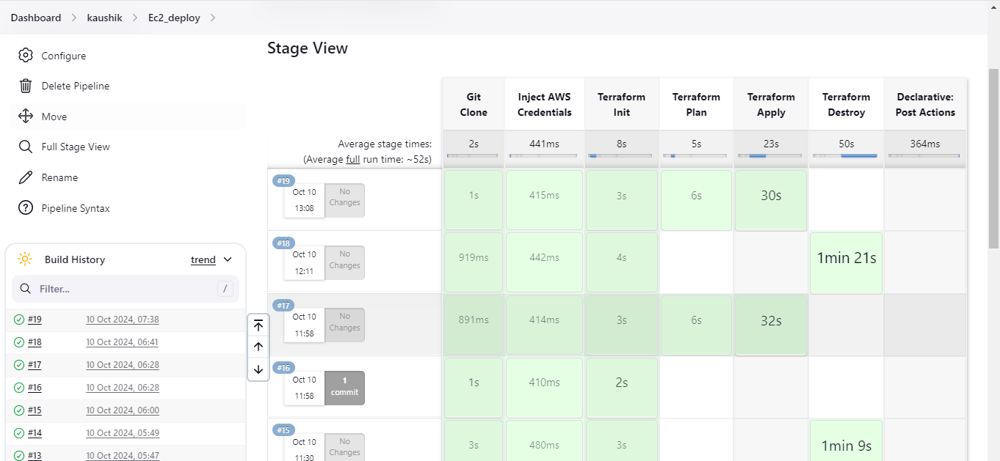

## API Endpoints Response
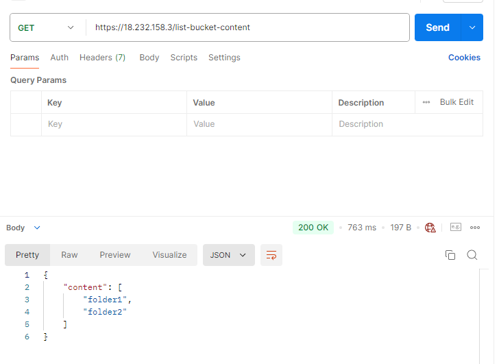
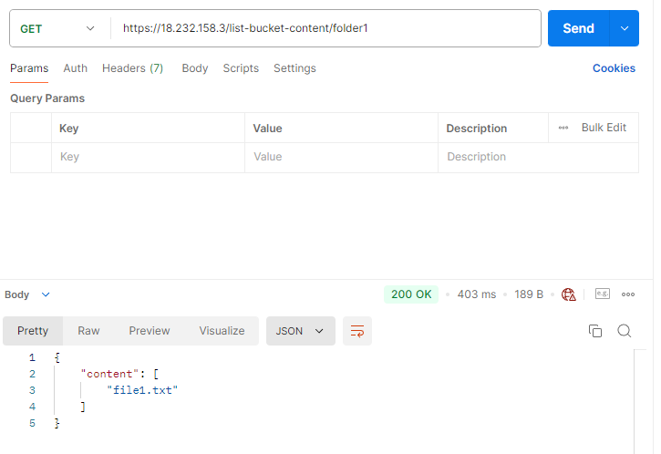
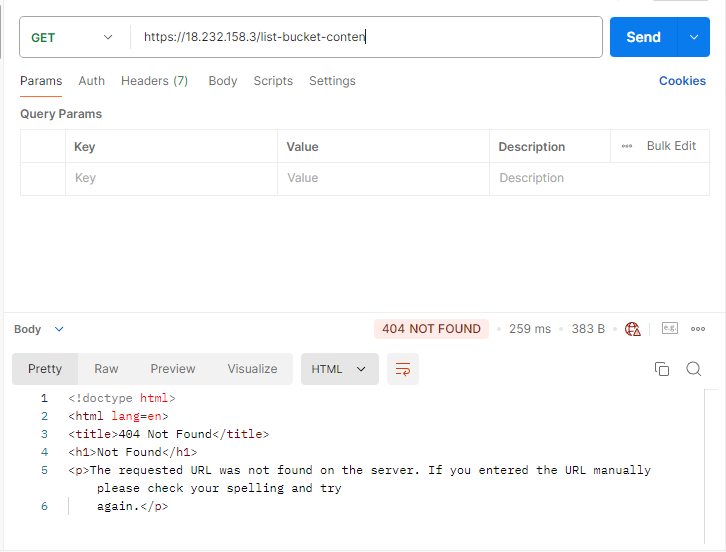

##S3 Bucket
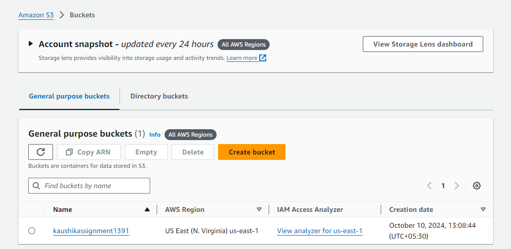
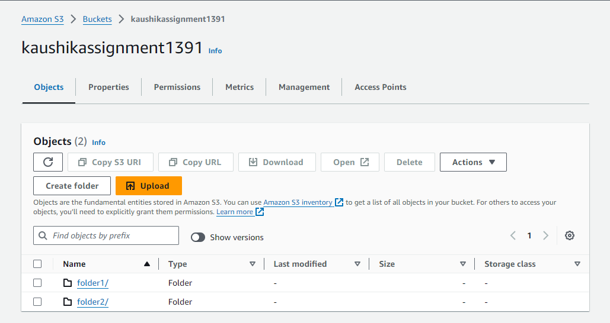
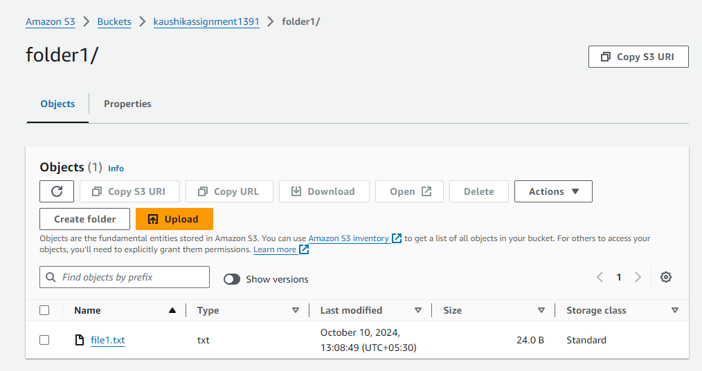
